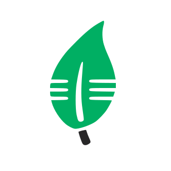

<html lang="fr">

<head>
    <!-- Required meta tags -->
    <meta charset="utf-8">
    <meta name="viewport" content="width=device-width, initial-scale=1">
    <!-- Bootstrap CSS -->
    <link href="https://cdn.jsdelivr.net/npm/bootstrap@5.1.3/dist/css/bootstrap.min.css" rel="stylesheet"
        integrity="sha384-1BmE4kWBq78iYhFldvKuhfTAU6auU8tT94WrHftjDbrCEXSU1oBoqyl2QvZ6jIW3" crossorigin="anonymous">
    <title>Conférences 2022 🚀</title>
</head>

<body>
    <main>
        <section class="text-center container">
            

                

                    
                    <h1 class="fw-light">🚀 Conférence de Demain 🚀</h1>
                    

                        L’association Conférence de Demain lance sa première édition le 13 Janvier 2022 !
                    

                    

                        <a href="https://www.linkedin.com/company/conference-de-demain/" class="btn btn-primary my-2"
                            style="background-color: #0e76a8;" target="_blank">LinkedIn</a>
                        <a href="mailto:conferences-lille@viacesi.fr" class="btn btn-secondary my-2">Contact mail</a>
                    

                

            

        </section>
        

            

                <h1>💬 Thèmes 💬</h1>
                

                

                    

                        

                            

                                <h5 class="card-title" style="font-weight: bold;">☁ L'Énergie du Cloud ☁</h5>
                                
Comment le Cloud peut continuer à fonctionner et à être de plus en plus utilisé tout en réduisant son impact environnemental et devenir une source d'énergie pour notre confort et notre cadre de vie

                                

                                    <small class="text-muted">30 mins</small>
                                

                            

                        

                    

                    

                        

                            

                                <h5 class="card-title" style="font-weight: bold;">⚡ Réseau Électrique Intelligent ⚡</h5>
                                
Les réseaux électriques intelligents ont pour but de proposer des modèles de réseaux électrique pour nos villes de demain. En effet, l’électricité est l’énergie de plus en plus utilisée par les particuliers, à l’instar des énergies fossiles.

                                

                                    <small class="text-muted">30 mins</small>
                                

                            

                        

                    

                    

                        

                            

                                <h5 class="card-title" style="font-weight: bold;">🧠 L'Intelligence Artificielle au
                                    Service des villes 🧠</h5>
                                
L'attente devant un feu de circulation représente énormément de temps perdu et une pollution conséquente. Comment l'intelligence artificielle peut nous aider à optimiser ces flux dans la ville ?

                                

                                    <small class="text-muted">30 mins</small>
                                

                            

                        

                    

                

            

        

         
        

            

                <h1>❓ Qui sommes-nous ?❓ </h1>
                

                
L'association Conférence de demain est une initiative étudiante de CESI Ecole d'Ingénieurs : les étudiants de la filière informatique lilloise vous proposeront chaque année d'organiser une série de conférences sur la thématique des villes durables dans le cadre de leur dernière année de formation. 
                L'objectif sera d'échanger autour des thématiques technologiques, énergétiques et écologiques de notre futur.

            

        

         
        

            

                <h1>⏳ Déroulement ⏳</h1>
                

                
La conférence aura lieu le <strong>13/01/2020</strong> au <strong>Quai des Vignes</strong> à <strong>Roubaix</strong> (à confirmer).  
                13h45 : Accueil du public 
                14h15 : Introduction et présentations 👋  
                14h30 : Conférence « L’énergie du CLOUD » ☁ 
                15h15 : Conférence « Réseau électrique intelligent » ⚡  
                15h45 : Entracte : cafés et viennoiseries offerts ! ☕  
                16h30 : Conférence « IA au service des villes » 🧠 
                17h15 : Clôture et remerciements 👏  
                17h30 : Moment d'échange au Quai des Vignes
                

            

        

    </main>
    <footer class="text-muted py-5">
        

            

                <a href="#">Haut de la page</a>
            

            

                &copy;
                
                    
                
                Conférence de Demain
            

        

    </footer>
    <!-- Optional JavaScript -->
    

</body>

</html>